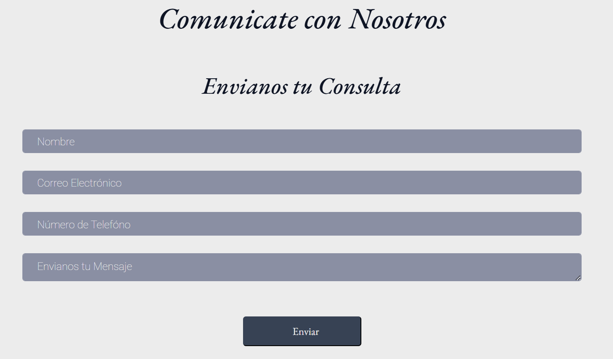

 # PROYECTO FINAL - CODERHOUSE
 # Estudio Jurídico Dr. Cristian Martínez

Este proyecto es el resultado del trabajo final del curso de Desarrollo Web en Coderhouse. Se trata de un sitio web para el ***Estudio Jurídico del Dr. Cristian Martínez*** ubicado en la Ciudad de Córdoba, Argentina, especializado en:

- ***Derecho de Familia***
- ***Violencia Familiar y de Género***
- ***Derecho Laboral***
- ***Derecho Civil***
- ***Derecho Penal***

## Descripción del Proyecto

El sitio web tiene como objetivo ofrecer una presentación clara y concisa de los servicios del Estudio Jurídico, facilitando la comunicación con los clientes a través de un formulario de contacto y proporcionando información relevante sobre el ámbito legal y el trabajo del Dr. Martínez.
Cabe también aclarar que dicho Proyecto cuenta con diseño responsive, para tablet y desktop.

## Páginas del Sitio Web

El sitio cuenta con 4 páginas:

> ##### 1. **Página de Inicio:**
   - Descripción general del Estudio Jurídico.
   - Presentación del mismo.

> ##### 2. **Servicios:**
   - Resumen de los servicios ofrecidos en cada una de las ramas del derecho: Derecho de Familia, Violencia Familiar y de Género, Derecho Laboral, Civil y Penal.
   - Explicación breve sobre cada área de práctica legal más imagen referencial.

> ##### 3. **Página de Contacto:**
   - Formulario para que los usuarios puedan realizar consultas o solicitar información adicional.
   - Ubicación con Mapa de Google Maps incluído más el enlace al mismo tanto desde el Mapa como desde el Título.
   - Dirección e Información de contacto adicional (horario de atención,teléfono, correo electrónico) y enlace a WhatsApp.

> ##### 4. **Novedades del Poder Judicial:**
   - Espacio para mostrar actualizaciones y noticias relacionadas con el ámbito judicial, asegurando que los clientes se mantengan informados sobre las últimas novedades legales.

## Tecnologías Utilizadas

- **HTML5**: Estructura del sitio web.
- **CSS3**: Estilo y diseño responsivo.
- **Sass**: Preprocesador CSS para una escritura más modular y eficiente de los estilos.
- **Bootstrap**: Para el diseño responsive y componentes rápidos.
- **Flexbox y Grid**: Para crear un diseño flexible y organizado, utilizando técnicas modernas de disposición de elementos.
- **Box Model**: Para el control preciso de márgenes, rellenos y bordes de los elementos.

## Logo en el Menú de Navegación

En el menú de navegación, el logo se muestra como un **video** que fue creado utilizando **Canva**. Este video tiene un efecto visual atractivo y actúa como una representación dinámica de la marca del Estudio Jurídico. Además, la **portada** también presenta otro video realizado con **Canva**, que da una bienvenida interactiva a los usuarios del sitio.

## Videos e Imagenes

### Cómo Subir una Imagen en HTML

Para incluir una imagen en HTML, se utiliza la etiqueta **``**. Aquí tienes un ejemplo básico:
```html

```

- **src:** Especifica la ruta de la imagen (puede ser una ruta relativa o un enlace URL).
- **alt:** Proporciona una descripción alternativa de la imagen, que es útil para accesibilidad y SEO.

### Cómo Subir un Video en HTML

Para agregar un video, se utiliza la etiqueta **`<video>`**. Aquí tienes un ejemplo básico de cómo incluir un video que puede ser autoloaded o controlado por el usuario:
```html
<video width="320" height="240" controls>
  <source src="video/logo-video.mp4" type="video/mp4">
  Tu navegador no soporta el formato de video.
</video>
```

- **width y height:** Especifican las dimensiones del video en píxeles.
- **controls:** Muestra los controles del video (como play, pausa, volumen, etc.).
- **source:** Especifica la ruta del archivo de video (también puede ser una URL).
- **type:** Define el formato del video.
  
Ejemplo para el logo en video:
```html
<video width="320" height="240" controls>
  <source src="videos/logo-video.mp4" type="video/mp4">
  Tu navegador no soporta el formato de video.
</video>
```

En nuestro sitio el logo y la portada contienen los siguientes videos (**haz click en las imagenes para acceder a los enlaces del video**):

- **Video del Logo:**

[](https://drive.google.com/file/d/1790N2zcJidXwYbPY7QEXctXXvm3sGnlE/view?usp=sharing)

- **Video de Portada**

[](https://drive.google.com/file/d/1JrFvCvm6fNiMlEzSkBMAVmH80tP8kQkB/view?usp=sharing)

## Formulario de Contacto

Además de Imágenes y Videos, El sitio web  incluye un formulario de contacto que permite a los usuarios enviar consultas o solicitudes de información adicional de manera rápida y sencilla.

Este formulario permite recopilar la siguiente información del usuario:

>- Nombre completo
>- Correo electrónico
>- Teléfono
>- Mensaje o consulta
  
Este formulario se encuentra en la página de contacto del sitio web y es una herramienta útil para mantener una comunicación fluida entre el Estudio Jurídico y sus clientes.

### Implementación del Formulario en HTML

Para crear un formulario en HTML, se utiliza la etiqueta **`<form>`**, junto con diferentes tipos de campos de entrada como **`<input>`**, **`<textarea>`** y **`<button>`**. A continuación, te muestro cómo está estructurado el formulario de contacto:

```html
<form action="tu-script-de-envio.php" method="POST">
  <label for="nombre">Nombre completo:</label>
  <input type="text" id="nombre" name="nombre" required>
  
  <label for="email">Correo electrónico:</label>
  <input type="email" id="email" name="email" required>
  
  <label for="telefono">Teléfono (opcional):</label>
  <input type="tel" id="telefono" name="telefono">
  
  <label for="mensaje">Mensaje:</label>
  <textarea id="mensaje" name="mensaje" required></textarea>
  
  <button type="submit">Enviar</button>
</form>
```

### Explicación del código del formulario

**`<form>`:** Define el formulario y especifica el archivo donde se enviarán los datos. En este caso, el atributo action se refiere a un script de servidor (como un archivo PHP o un script en el backend) que procesará los datos enviados. El atributo method="POST" indica que los datos se enviarán utilizando el método POST (más seguro para enviar información).

**`<label>`:** Se utiliza para definir una etiqueta que describe el propósito de cada campo en el formulario.

**`<input>`:** Es el campo de entrada donde el usuario puede escribir su información. Los tipos de entrada utilizados son:

- **type="text":** Para el nombre completo.
- **type="email":** Para el correo electrónico (esto también permite validación automática de la dirección de correo electrónico).
- **type="tel":** Para el número de teléfono (opcional).
  
**`<textarea>`:** Permite al usuario escribir un mensaje o consulta. Este campo puede contener varias líneas de texto.

**`<button>`:** Este botón permite enviar el formulario. Al hacer clic, los datos serán enviados al servidor para ser procesados.

En este Proyecto el formulario quedó así:



## Aquí comparto algunas imagenes del Sitio


  
### Te invito que accedas al sitio a través del siguiente Enlace

[Estudio Juridico Dr. Cristian Martinez](https://mafetech24.github.io/pfinalcoderhouse-cjweb/)